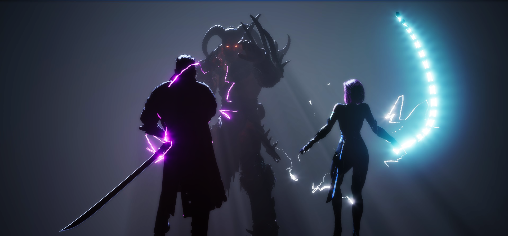
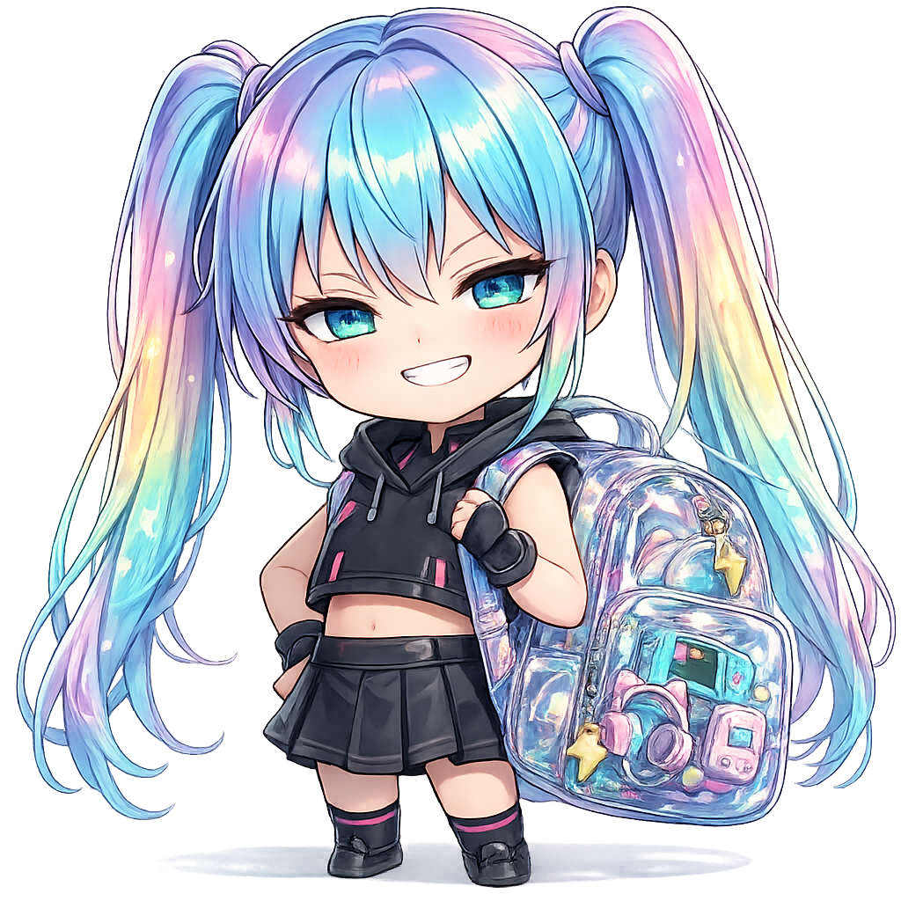
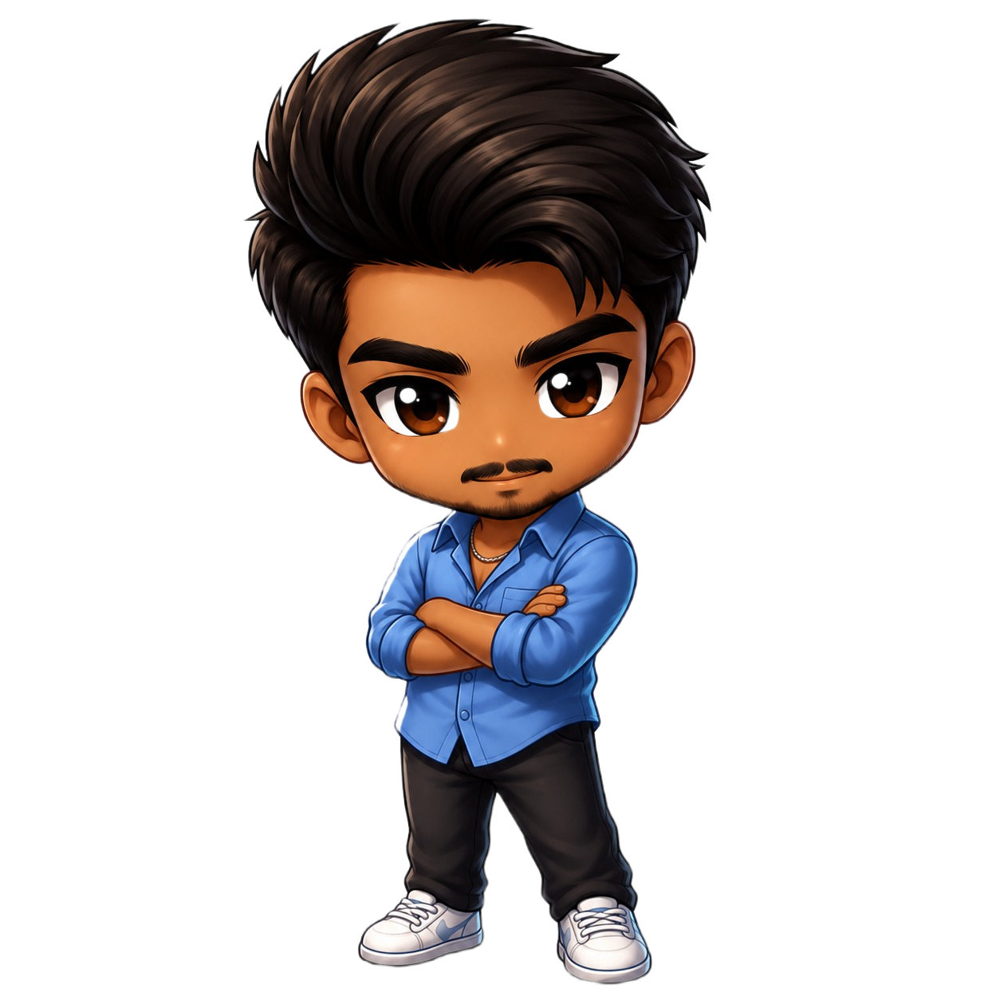

<!-- ═══════════════════════════════════════════════════════════════════════ -->
<!--  JOHITH-TEX  •  GitHub Profile README  •  Retro/Pixel Art Theme       -->
<!-- ═══════════════════════════════════════════════════════════════════════ -->

<!-- Profile Views Counter -->
<div align="right">
  
</div>

<!-- ╔══════════════════════════════════════════╗ -->
<!-- ║           ANIMATED HEADER BANNER          ║ -->
<!-- ╚══════════════════════════════════════════╝ -->

<div align="center">
  
</div>

<br/>


<!-- ╔══════════════════════════════════════════╗ -->
<!-- ║           CHARACTER STATS                  ║ -->
<!-- ╚══════════════════════════════════════════╝ -->

## Character Stats

<div align="center">
<table>
<tr>
<td width="420" valign="top" align="center">


```
╔══════════════════════════════════╗
║       PLAYER  PROFILE            ║
╠══════════════════════════════════╣
║                                  ║
║  Name ··· Johith-Tex             ║
║  Class ·· Full-Stack Developer   ║
║  Race ··· Code Wizard            ║
║  Guild ·· Open Source            ║
║  Level ·· ∞                      ║
║                                  ║
╚══════════════════════════════════╝
```

Currently questing on **Gate to Oblivion** (UE5)

Built **Texie** — a powerful Discord companion

Crafting **Uzhavar AI** — smart agriculture platform

Leveling up in **AI/ML** & **Advanced Game Dev**

`while(alive) { code(); sleep(maybe); }`

</td>
<td width="480" valign="top" align="center">

<a href="https://github.com/Johith-Tex">
  
</a>

<br/>

<a href="https://github.com/Johith-Tex">
  
</a>

</td>
</tr>
</table>
</div>

<br/>


<!-- ╔══════════════════════════════════════════╗ -->
<!-- ║          INVENTORY — TECH STACK            ║ -->
<!-- ╚══════════════════════════════════════════╝ -->

## Inventory — Tech Stack

<div align="center">

### Languages


### Frameworks & Engines


### Tools & Platforms


</div>

<br/>


<!-- ╔══════════════════════════════════════════╗ -->
<!-- ║       QUEST LOG — FEATURED PROJECTS        ║ -->
<!-- ╚══════════════════════════════════════════╝ -->

## Quest Log — Featured Projects

<div align="center">

<table>
<tr>

<td width="50%" align="center" valign="top">
<h3>Uzhavar AI</h3>

<a href="https://github.com/Johith-Tex/uzhavar-ai">
  
</a>

<br/><br/>
<p><em>AI-powered agricultural platform empowering farmers with smart insights & predictions</em></p>
<p>
  
  
  
</p>
</td>

<td width="50%" align="center" valign="top">
<h3>Gate to Oblivion</h3>

<a href="https://github.com/Johith-Tex/gate-to-oblivion">
  
</a>

<br/><br/>
<p><em>Epic action RPG built in Unreal Engine 5 — face the void, survive the unknown</em></p>
<p>
  
  
  
</p>
</td>

</tr>
<tr>

<td width="50%" align="center" valign="top">
<h3>Texie</h3>

<a href="https://github.com/Johith-Tex/texie">
  
</a>

<br/><br/>
<p><em>Feature-rich Discord bot — moderation, fun commands, and your server's best companion</em></p>
<p>
  
  
  
</p>
</td>

<td width="50%" align="center" valign="top">
<h3>Mascot Portfolio</h3>

<a href="https://github.com/Johith-Tex/mascot-portfolio">
  
</a>

<br/><br/>
<p><em>Personal portfolio site with a unique mascot-themed design that brings personality to the web</em></p>
<p>
  
  
  
</p>
</td>

</tr>
</table>

</div>

<br/>


<!-- ╔══════════════════════════════════════════╗ -->
<!-- ║              BATTLE STATS                  ║ -->
<!-- ╚══════════════════════════════════════════╝ -->

## Battle Stats

<div align="center">

<!-- Streak Stats -->
<a href="https://github.com/Johith-Tex">
  
</a>

<br/><br/>

<!-- Activity Graph -->
<a href="https://github.com/Johith-Tex">
  
</a>

</div>

<br/>

<!-- ╔══════════════════════════════════════════╗ -->
<!-- ║              FOOTER                       ║ -->
<!-- ╚══════════════════════════════════════════╝ -->



<!-- ═══════════════════════════════════════════════════════════════════════ -->
<!--  Built with love, code, and way too much coffee                       -->
<!-- ═══════════════════════════════════════════════════════════════════════ -->
